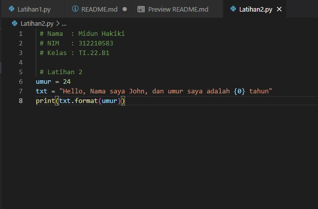

#   PRAKTIKUM 10

-   Nama    : Midun Hakiki
-   NIM     : 312210583
-   Kelas   : TI.22.B1
-   Matkul  : Bahasa Pemograman

#   Mengakses Nilai dalam String

1.  Pertama kita buat folder Praktikum10 dan didalam folder tersebut kita buat file latihan1.py  dan latihan2.py.

2.  Lalu buka file latihan1.py dan masukan codingan sebagai berikut ini, dan lalu di run atau jalankan programnya pada latihan1.py :

        txt = 'Hello World'
        print('variabel txt : '+ txt)

        print("hitung jumlah karakter : " + str(len(txt)))

        print("ambil karakter terakhir : " + txt[len(txt)-1])

        print('ambil karakter terakhir : ' + txt[2:5])

        print('hilangkan spasi pada Hello World : ' + txt.replace(" ", ''))

        print('ubah text jadi huruf besar : ' + txt.upper())

        print('ubah text jadi huruf kecil : ' + txt.lower())

        print('ganti karakter H jadi J : ' + txt.replace('H', 'J'))

Dan berikut ini adalah hasilnya :

3.  Selanjutnya kita buka file latihan2.py dan masukan codingan seperti berikut ini, lalu run atau jalankan programnya pada latihan2.py :

        umur = 24
        txt = "Hello, Nama saya John, dan umur saya adalah {0} tahun"
        print(txt.format(umur))

Dan berikut ini adalah hasilnya :

#   Demikian penjelasan dari saya jika ada kekurangan mohon maaf...

#   Terimakasih...